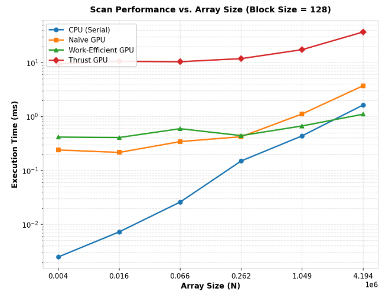
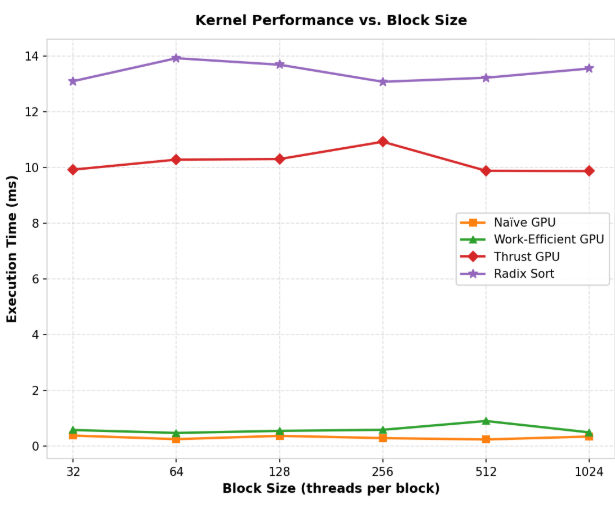

CUDA Stream Compaction
======================

**University of Pennsylvania, CIS 565: GPU Programming and Architecture, Project 2**

* Sau Lok Li
* Tested on: Windows, AMD Ryzen 9 270 w/ Radeon 780M Graphics, NVIDIA GeForce RTX 5070 Laptop GPU (8151 MiB), driver 596.13

## Project Description

This project implements prefix-sum (exclusive scan) and stream compaction in CUDA. Given an integer array, scan produces the sum of all preceding elements, while compaction removes zero-valued elements and preserves the order of the remaining values. The project compares a simple serial CPU implementation with two hand-written GPU algorithms and NVIDIA Thrust.

## Features

- CPU serial implementations of exclusive `scan`, `compactWithoutScan`, and `compactWithScan` for correctness and baseline timing.
- GPU implementations:
  - Naive parallel scan (multiple passes).
  - Work-efficient Blelloch scan (upsweep / downsweep).
  - Thrust-based exclusive scan using `thrust::exclusive_scan` for comparison.
  - Work-efficient GPU stream compaction using map, scan, and scatter.
- Performance timers for CPU (std::chrono) and GPU (CUDA events).
- Correctness tests for power-of-two and non-power-of-two input sizes.

## Build and Run

Build in Release mode (always profile Release builds):

mkdir build
cd build
cmake -G Ninja ..
cmake --build . --config Release

Run the test binary from `build/bin` and paste the console output into the `README.md` under the "Test Output" section below.

## Performance Analysis

All GPU measurements isolate kernel execution times using CUDA events (`cudaEventRecord`), excluding `cudaMalloc`, `cudaFree`, and host-device `cudaMemcpy` transfers. CPU benchmarks isolate serial loop routines using `std::chrono::high_resolution_clock`.

### Hardware Specifications

- GPU: NVIDIA GeForce RTX 5070 Laptop GPU (8151 MiB VRAM, Compute Capability 12.0), driver 596.13
- CPU: AMD Ryzen 9 270 w/ Radeon 780M Graphics (8 cores / 16 threads)
- OS: Windows 11 Home

### Block-Size Tuning

To establish fair comparisons, each GPU kernel was swept across thread block sizes from 32 to 1024 threads on a $2^{20}$ (1,048,576) element array:

| Implementation | Selected block size | Measured time (ms) |
| --- | ---: | ---: |
| Naive GPU Scan | 512 | 0.2365 |
| Work-Efficient GPU Scan | 64 | 0.4712 |
| Thrust GPU Scan | 1024 | 9.8633 |
| Radix Sort (extra credit) | 256 | 13.0671 |

| Implementation | Optimal block size | Performance characteristics |
| --- | ---: | --- |
| Naive GPU Scan | 512 | Peak throughput reached when hiding global-memory latency. |
| Work-Efficient GPU Scan | 64 | Smaller block size minimizes thread idle divergence in upper tree levels. |
| Thrust GPU Scan | 1024 | Best launch configuration for the internal library stream context. |
| Radix Sort (extra credit) | 256 | Balances register usage and occupancy over 32-bit passes. |

### Scan Comparison

The following benchmarks analyze execution time across array scaling ($N = 4,096$ to $4,194,304$) and block-size tuning (32 to 1024 threads).

#### Execution Time vs. Array Size (Block Size = 128)

| Array size ($N$) | CPU Scan (ms) | Naive GPU Scan (ms) | Work-Efficient GPU Scan (ms) | Thrust GPU Scan (ms) |
| ---: | ---: | ---: | ---: | ---: |
| 4,096 | 0.0025 | 0.2412 | 0.4181 | 9.5549 |
| 16,384 | 0.0073 | 0.2170 | 0.4107 | 10.6445 |
| 65,536 | 0.0261 | 0.3448 | 0.5978 | 10.4384 |
| 262,144 | 0.1507 | 0.4243 | 0.4451 | 11.9080 |
| 1,048,576 | 0.4404 | 1.1223 | 0.6726 | 17.4722 |
| 4,194,304 | 1.6450 | 3.7398 | 1.1096 | 37.1464 |



#### Execution Time vs. Block Size ($N = 1,048,576$)

| Block size | CPU Scan (ms) | Naive GPU Scan (ms) | Work-Efficient GPU Scan (ms) | Thrust GPU Scan (ms) | Radix Sort (ms) |
| ---: | ---: | ---: | ---: | ---: | ---: |
| 32 | 0.0204 | 0.3764 | 0.5757 | 9.9151 | 13.0878 |
| 64 | 0.0203 | 0.2478 | 0.4712 | 10.2740 | 13.9126 |
| 128 | 0.0367 | 0.3658 | 0.5447 | 10.2949 | 13.6791 |
| 256 | 0.0214 | 0.2845 | 0.5832 | 10.9158 | 13.0671 |
| 512 | 0.0217 | 0.2365 | 0.8988 | 9.8743 | 13.2119 |
| 1024 | 0.0208 | 0.3417 | 0.4906 | 9.8633 | 13.5421 |



### Comparative Analysis and Bottlenecks

- **Serial CPU dominance at small $N$:** For $N \le 262,144$, serial CPU scan significantly outperforms all GPU implementations. At small input sizes, CPU execution stays within L1/L2 caches and avoids grid-launch synchronization overhead and memory-bus latency.
- **Work-efficient GPU crossover at large $N$:** At $N = 4,194,304$, Work-Efficient GPU scan (1.1096 ms) outperforms serial CPU scan (1.6450 ms) and Naive GPU scan (3.7398 ms). Its total work and memory traffic scale linearly with $N$.
- **Naive GPU memory-bandwidth bottleneck:** The Naive scan performs $\lceil \log_2 N \rceil$ passes, with each pass reading and writing the full array. This creates severe global-memory traffic as $N$ grows.
- **Work-Efficient launch and divergence overhead:** During upsweep and downsweep, active thread count drops at higher tree levels. The resulting low occupancy and launch overhead make Work-Efficient scan slower on smaller datasets.
- **Thrust latency floor:** Thrust shows a baseline of approximately 9.8-10 ms across small and medium arrays. Internal stream setup, temporary storage management, and multi-phase CUB dispatch dominate until very large inputs.

### Thrust Nsight Timeline Analysis

`thrust::exclusive_scan` exhibits a persistent baseline cost of approximately 9.8-10 ms. An NVIDIA Nsight Systems timeline identifies the following contributors:

- **Internal temporary allocations:** Thrust determines temporary storage requirements and issues internal device allocations or CUB temporary-buffer operations even when input and output pointers are pre-allocated.
- **Stream synchronization and kernel decomposition:** Thrust uses optimized CUB primitives that decompose the scan into tile-status initialization, reduction, and prefix-scan distribution kernels. Inter-kernel synchronization and device-side memory barriers create a fixed latency floor.

## Extra Credit: GPU Radix Sort

### Value and Algorithm Design

Radix sort provides non-comparative parallel integer sorting in $\mathcal{O}(k \cdot N)$ time, where $k$ is the word size in bits. For a 32-bit key, the implementation executes 32 sequential passes:

1. **Bit extraction (map):** Extract bit $b$ from each entry to construct a predicate array $e_i = 1 - b_i$.
2. **False-index scan:** Run a work-efficient exclusive scan on $e_i$ to calculate destination indices for elements with bit 0.
3. **Total false-count computation:** Compute $f_{total} = e_{N-1} + f_{N-1}$.
4. **Scatter destination calculation:** Compute $t_i = i - f_i + f_{total}$ for bit-1 elements and write values to a secondary ping-pong buffer.

### Calling API Example

```cpp
#include <stream_compaction/radix.h>

int main() {
    const int SIZE = 1 << 20;
    std::vector<int> h_in(SIZE);
    std::vector<int> h_out(SIZE);

    // Populate h_in with random integers.

    int *d_in, *d_out;
    cudaMalloc((void**)&d_in, SIZE * sizeof(int));
    cudaMalloc((void**)&d_out, SIZE * sizeof(int));
    cudaMemcpy(d_in, h_in.data(), SIZE * sizeof(int), cudaMemcpyHostToDevice);

    StreamCompaction::Radix::sort(SIZE, d_out, d_in);

    cudaMemcpy(h_out.data(), d_out, SIZE * sizeof(int), cudaMemcpyDeviceToHost);
    cudaFree(d_in);
    cudaFree(d_out);
    return 0;
}
```

At $N = 1,048,576$, Radix Sort completes in 13.0671 ms with an optimal block size of 256 threads. The higher execution time relative to a single scan is expected because it executes 32 scan and scatter passes.

```text
****************
** RADIX SORT **
****************
==== radix sort, power-of-two ====
   elapsed time: 13.0671ms    (CUDA Measured)
    passed
==== radix sort, non-power-of-two ====
   elapsed time: 14.1225ms    (CUDA Measured)
    passed
```

## Test Output

```text

****************
** SCAN TESTS **
****************
    [   4  36   0   4  17   0   0  16  41  24  32  40  28 ...  38   0 ]
==== cpu scan, power-of-two ====
   elapsed time: 0.0261ms    (std::chrono Measured)
    [   0   4  40  40  44  61  61  61  77 118 142 174 214 ... 1609065 1609103 ]
==== cpu scan, non-power-of-two ====
   elapsed time: 0.0276ms    (std::chrono Measured)
    [   0   4  40  40  44  61  61  61  77 118 142 174 214 ... 1608989 1609018 ]
    passed
==== naive scan, power-of-two ====
   elapsed time: 0.344832ms    (CUDA Measured)
    passed
==== naive scan, non-power-of-two ====
   elapsed time: 0.293568ms    (CUDA Measured)
    passed
==== work-efficient scan, power-of-two ====
   elapsed time: 0.59776ms    (CUDA Measured)
    passed
==== work-efficient scan, non-power-of-two ====
   elapsed time: 0.469344ms    (CUDA Measured)
    passed
==== shared memory scan, power-of-two ====
   elapsed time: 0.14144ms    (CUDA Measured)
    a[256] = 6159, b[256] = 0
    FAIL VALUE
==== shared memory scan, non-power-of-two ====
   elapsed time: 0.039072ms    (CUDA Measured)
    a[256] = 6159, b[256] = 0
    FAIL VALUE
==== thrust scan, power-of-two ====
   elapsed time: 10.4384ms    (CUDA Measured)
    passed
==== thrust scan, non-power-of-two ====
   elapsed time: 2.25821ms    (CUDA Measured)
    passed

*****************************
** STREAM COMPACTION TESTS **
*****************************
    [   3   1   2   0   1   2   2   2   3   2   2   2   3 ...   0   0 ]
==== cpu compact without scan, power-of-two ====
   elapsed time: 0.0923ms    (std::chrono Measured)
    [   3   1   2   1   2   2   2   3   2   2   2   3   3 ...   2   1 ]
    passed
==== cpu compact without scan, non-power-of-two ====
   elapsed time: 0.0835ms    (std::chrono Measured)
    [   3   1   2   1   2   2   2   3   2   2   2   3   3 ...   3   2 ]
    passed
==== cpu compact with scan ====
   elapsed time: 0.2869ms    (std::chrono Measured)
    [   3   1   2   1   2   2   2   3   2   2   2   3   3 ...   2   1 ]
    passed
==== work-efficient compact, power-of-two ====
   elapsed time: 0.548384ms    (CUDA Measured)
    passed
==== work-efficient compact, non-power-of-two ====
   elapsed time: 0.608032ms    (CUDA Measured)
    passed

****************
** RADIX SORT **
****************
==== radix sort, power-of-two ====
   elapsed time: 13.799ms    (CUDA Measured)
    passed
==== radix sort, non-power-of-two ====
   elapsed time: 14.4259ms    (CUDA Measured)
    passed
```

